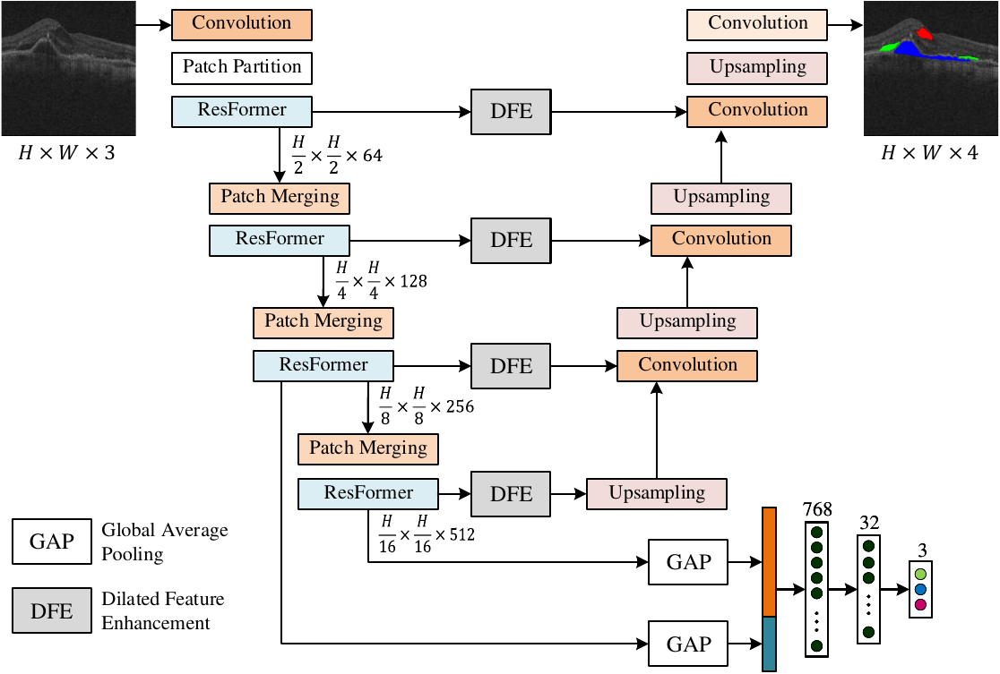

# **Implementation of ResFormer** - Artificial Intelligence in Medicine

**Multi-scale feature enhancement in multi-task learning for medical image analysis**
[ [paper](https://doi.org/10.1016/j.artmed.2025.103338) ]

We propose a simple yet effective UNet-based MTL model, where features extracted by the encoder are used to predict classification labels, while the decoder produces the segmentation mask. The model leverages an advanced encoder incorporating a novel ResFormer block that integrates local context from convolutional feature extraction with long-range dependencies modeled by the Transformer. This design captures broader contextual relationships and fine-grained details, improving classification and segmentation accuracy.

## Method



*The design of multi-task learning method for medical image classification and segmentation. The proposed method utilizes the U-Net architecture with a shared encoder and two dedicated decoders for the classification and segmentation tasks, respectively.*


## Repository layout

```
ResFormer/
├── train_mtl.py                         # Training entry point — RETOUCH OCT (joint seg + cls)
├── test_mtl.py                          # Evaluation — RETOUCH OCT: Dice / IoU + Acc / Sen / Spe / AUC
├── train_mtl_isic.py                    # Training entry point — ISIC skin lesion
├── test_mtl_isic.py                     # Evaluation — ISIC skin lesion
├── utils.py                             # Evaluator, multi-label metrics, prediction colorization
└── src/
    ├── losses.py                        # DiceLoss, FocalLoss, Dice_and_FocalLoss
    ├── datasets/
    │   └── dataset.py                   # OCT_Dataset (RETOUCH) + ISIC_Dataset; cls labels from mask/CSV
    └── models/
        ├── ResFormer_MTL_Parallel.py    # ResFormer (Res34_Swin_MS) — used by train_mtl.py
        ├── ResFormer_MTL.py             # Res34_Swin_MS variant — used by test_mtl.py
        ├── basic_module.py              # PatchEmbed/Merging, Swin BasicLayer, Decoder, FEM, ECA
        └── attention.py                 # Channel/spatial attention blocks (ECA, PAM, CAM, ...)
```

## Installation

```bash
conda create -n resformer python=3.10 -y && conda activate resformer
# Install PyTorch for your CUDA version first (see https://pytorch.org)
pip install monai timm albumentations opencv-python fvcore torchsummary \
            scikit-learn scipy pandas matplotlib tqdm
```

## Data

ResFormer is trained on the **RETOUCH** OCT and ISIC challenge datasets.
The image-level multi-label classification target is derived automatically from the mask.

```
data/{dataset}/{machine}/{train,val}/
    images/<name>.png     # OCT B-scans
    masks/<name>.png      # label map with values 0..3
    {train,val}.txt       # one <name> per line
```

## Usage


**Training** 

```bash
# in train_mtl.py set: dataset='eyes', machine='S', seed=1234, base_dir, model_name
mkdir -p ckpt_mtl/eyes/1234/S
python train_mtl.py
```

**Evaluation**

```bash
# in test_mtl.py set: model_name to your checkpoint, base_dir, dataset, machine
python test_mtl.py
```

## Citation

If you use this code or find our work useful in your research, please consider citing:

```bibtex
@article{bui2025multi,
  title={Multi-scale feature enhancement in multi-task learning for medical image analysis},
  author={Bui, Phuoc-Nguyen and Le, Duc-Tai and Bum, Junghyun and Han, Jong Chul and Pham, Van-Nguyen and Choo, Hyunseung},
  journal={Artificial Intelligence in Medicine},
  pages={103338},
  year={2025},
  publisher={Elsevier}
}
```

## Acknowledgement

We thank the authors of the following projects and resources, whose work this implementation
builds upon:

- [Swin Transformer](https://github.com/microsoft/Swin-Transformer)
- [RETOUCH challenge](https://retouch.grand-challenge.org/)
- [ISIC challenge](https://challenge.isic-archive.com/data/)
